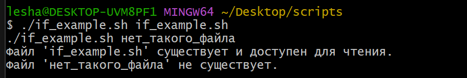
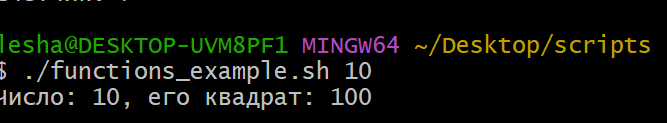
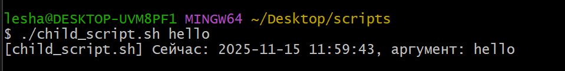

# Bash scripts

Набор простых bash-скриптов для демонстрации `if`, `while`, функций и вызова скриптов из других скриптов.

Кратко по каждому скрипту:
- `if_example.sh` — проверяет, существует ли файл и доступен ли он для чтения.
- `while_example.sh` — выводит числа от 1 до N с помощью цикла `while`.
- `functions_example.sh` — показывает вызов одной функции из другой.
- `child_script.sh` — выводит текущее время и переданный аргумент.
- `parent_script.sh` — дважды запускает `child_script.sh` с разными аргументами.

---

## if_example.sh

Запуск:

    ./if_example.sh if_example.sh
    ./if_example.sh нет_такого_файла

---

## while_example.sh

Запуск:

    ./while_example.sh 7

---

## functions_example.sh

Запуск:

    ./functions_example.sh 10

---

## child_script.sh

Запуск:

    ./child_script.sh тестовый_аргумент

---

## parent_script.sh

Запуск:

    ./parent_script.sh

