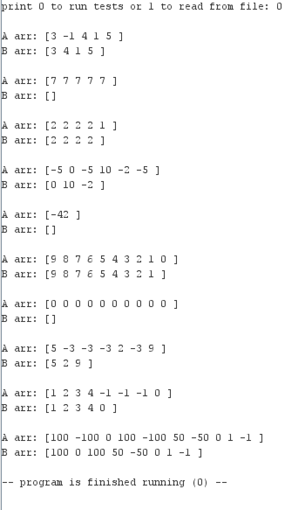
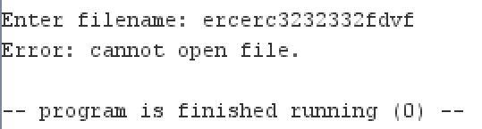
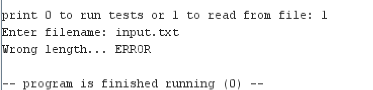

# Программа (RARS, RISC-V, вариант 13)

**Назначение:** из массива A (N, 1..10) построить массив B — A без всех минимальных элементов.  
**Режимы:** 0 — автотесты; 1 — из файла.  
**Файлы:** io.asm (обёртки ввода/вывода), program.asm (логика и данные), tests.asm (генераторы и раннер тестов), main.asm (.include и точка входа).  
**Техника:** подпрограммы с параметрами через стек и локальными переменными на стеке; модули разделены.

## ОТЧЕТ:
## Тест: состоит из 10 проверок

### Если запустить тест:


## Если переключиться на ввод из файла:

### -Если ввести некорректное имя:


### -Если ввести размер больше 10 или меньше 1:
input.txt:
```text
11
1 2 3 4 5 6 7 8 9 10 11
```


### -Для обычных случаев:
input.txt:
```text
1
-1
```
.png)

input.txt:
```text
9
2 2 -1 -1 -1 4 0 345 5
```
.png)
