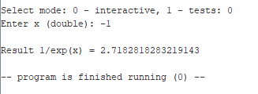
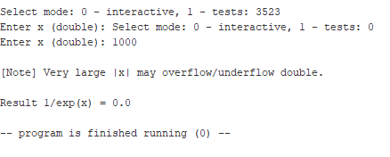
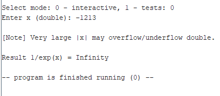

# АКОС — ИДЗ-2, вариант 6: `1/exp(x)` (RARS/RISC-V, double)
Режимы: `0` — интерактив; `1` — автотесты. Файлы: `macros.asm`, `math_exp.asm`, `main.asm`, `tests.asm`.

---

## Скриншоты и эталоны

### Автотесты (режим 1)

Эталонные значения `exp(-x)` и относительное отклонение результата программы:
- x = −10 → ref **22026.465794806718**; Δ ≈ **3.68×10⁻⁹ %**
- x = −5  → ref **148.4131591025766**;  Δ ≈ **8.18×10⁻¹² %**
- x = −1  → ref **2.718281828459045**;  Δ ≈ **5.05×10⁻⁹ %**
- x = −0.5 → ref **1.6487212707001282**; Δ ≈ **1.23×10⁻¹⁰ %**
- x = 0   → ref **1.0**;                 Δ ≈ **0 %**
- x = 0.5 → ref **0.6065306597126334**;  Δ ≈ **4.84×10⁻⁵ %**
- x = 1   → ref **0.36787944117144233**; Δ ≈ **8.76×10⁻⁹ %**
- x = 5   → ref **6.737946999085467e−03**; Δ ≈ **1.07×10⁻¹¹ %**
- x = 10  → ref **4.5399929762484854e−05**; Δ ≈ **6.38×10⁻⁹ %**
- x = 50  → ref **1.9287498479639178e−22**; Δ ≈ **8.53×10⁻¹⁴ %**
- x = 100 → ref **3.720075976020836e−44**;  Δ ≈ **9.02×10⁻¹¹ %**
- x = 700 → ref **9.85967654375977e−305**;  Δ ≈ **5.03×10⁻¹² %**

### Интерактивные примеры (режим 0)

`x = -1`
  
ref **2.718281828459045**; Δ ≈ **5.04×10⁻⁹ %**

`x ≈ -1.0535765475465256`
  
ref **2.8678899420644077**; Δ ≈ **1.86×10⁻⁸ %**

### Краевые случаи формата double

`x = 1000` → underflow к нулю  
  
ref **0.0**

`x = -1213` → overflow к бесконечности  
  
ref **Infinity**
